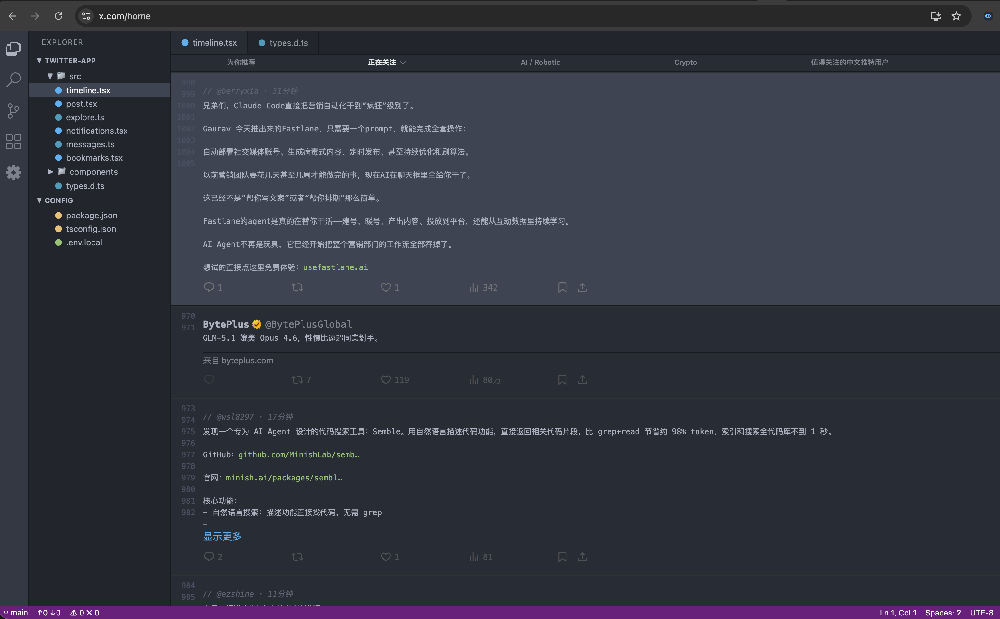
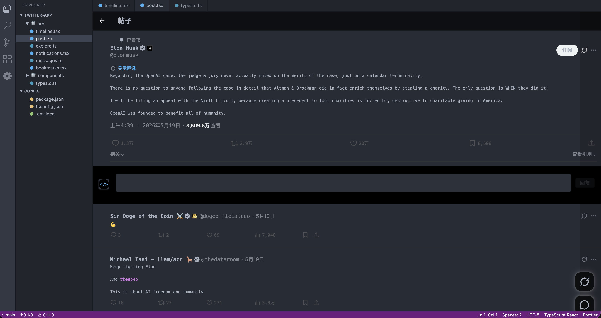
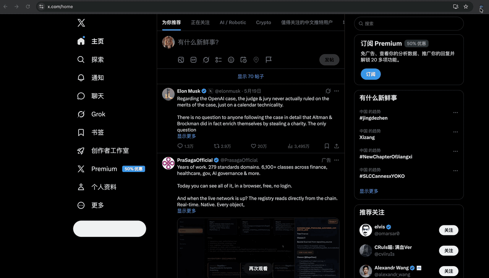
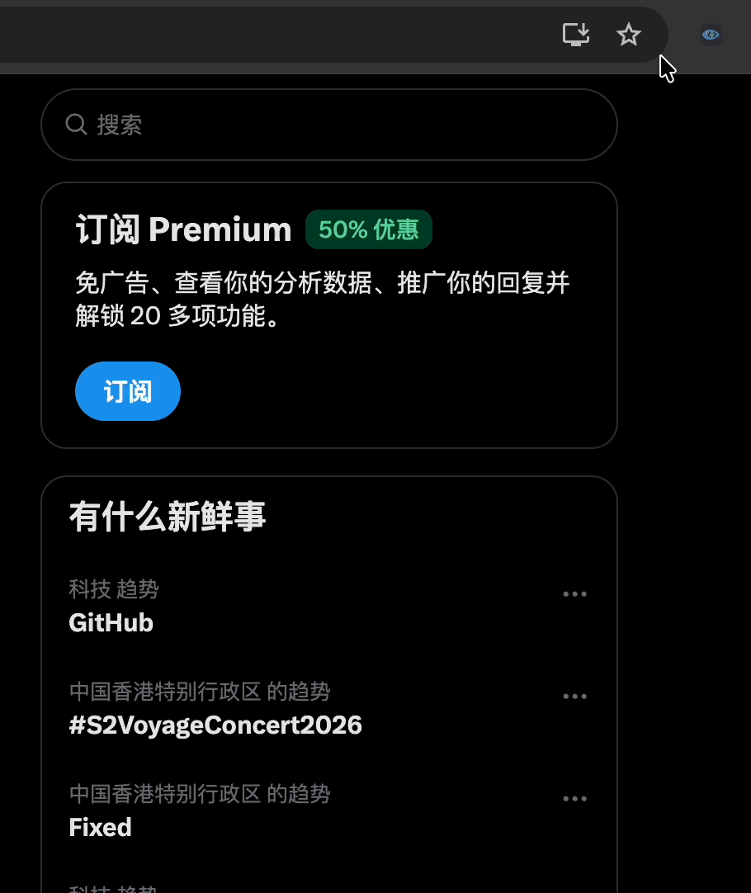

# Web Fish

> Disguise the web as VSCode — or just hide media. Currently supports **X/Twitter** and **Linux.do**.

> 把网页伪装成 VSCode —— 或者只是隐藏图片和视频。当前支持 **X/Twitter** 与 **Linux.do**。





---

## Features / 功能

- **VSCode Mode** — Activity bar, file-tree sidebar, tab bar, status bar, line numbers — the full IDE shell rendered over the page. Tweets / topics are recoloured as syntax-highlighted code; usernames become `// @handle · time` comments.
- **Hide Images** — Collapse all images with zero leftover space.
- **Hide Videos** — Collapse all videos with zero leftover space.
- **Hide Ads** — Twitter only (Linux.do has no ads).
- **Per-site toggles** — The popup automatically hides toggles a site doesn't support.
- **Instant toggle** — All changes take effect immediately, no page refresh needed.
- **Persistent settings** — Synced across sessions via `chrome.storage.sync`.

---

- **VSCode 模式** — 活动栏、文件树侧栏、标签栏、状态栏、行号 —— 完整 IDE 外壳覆盖在页面上。推文 / 话题以语法高亮的代码风重新呈现；用户名变成 `// @handle · 时间` 注释。
- **隐藏图片** — 折叠所有图片，不留占位。
- **隐藏视频** — 折叠所有视频，不留占位。
- **去除广告** — 仅 Twitter（Linux.do 没有广告）。
- **按站点显示开关** — popup 会自动隐藏当前站点不支持的开关。
- **即时生效** — 切换无需刷新页面。
- **设置持久化** — 通过 `chrome.storage.sync` 跨会话同步。

## Menu / 菜单



## Install / 安装

### From Release / 从 Release 下载

1. Go to [Releases](../../releases) and download the latest zip / 前往 [Releases](../../releases) 下载最新 zip
2. Unzip to any folder / 解压到任意文件夹
3. Open `chrome://extensions` / 打开 `chrome://extensions`
4. Enable **Developer mode** (top-right toggle) / 开启右上角「开发者模式」
5. Click **Load unpacked** / 点击「加载已解压的扩展程序」
6. Select the unzipped folder / 选择解压后的文件夹

### From Source / 从源码安装

1. Clone this repository / 克隆本仓库
2. Open `chrome://extensions` / 打开 `chrome://extensions`
3. Enable **Developer mode** / 开启「开发者模式」
4. Click **Load unpacked** / 点击「加载已解压的扩展程序」
5. Select the project folder / 选择项目文件夹

## Usage / 使用

Click the extension icon in your browser toolbar — the popup detects the active tab and shows only the toggles supported by that site.

点击浏览器工具栏中的扩展图标，popup 会自动识别当前 tab 并只显示该站点支持的开关。

| Toggle / 开关 | Twitter / X | Linux.do |
| --- | :---: | :---: |
| VSCode Mode / VSCode 模式 | ✅ | ✅ |
| Hide Ads / 去除广告 | ✅ | — |
| Hide Images / 隐藏图片 | ✅ | ✅ |
| Hide Videos / 隐藏视频 | ✅ | ✅ |

## Architecture / 架构

Web Fish uses a **pluggable site-adapter** architecture. Adding a new site means dropping a folder under `sites/` and adding one entry to `manifest.json` — the core never changes.

Web Fish 采用**插件式站点适配器**架构。新增一个站点 = 在 `sites/` 下加一个目录 + 在 `manifest.json` 加一条 content_scripts —— 核心代码不需要改。

```
twitter-fish/
├── manifest.json            # one content_scripts entry per site
├── content.js               # bootstrap: pick adapter → drive core
├── popup.html / popup.js    # active-tab capabilities → toggle visibility
├── core/                    # site-agnostic
│   ├── registry.js          #   adapter registration
│   ├── style-toggle.js      #   inject/remove <style> tags
│   ├── shell.js             #   activity bar, sidebar, tabbar, status bar
│   └── transformer.js       #   MutationObserver + line-number gutter
├── shared/
│   ├── match.js             # host → site-id (used by popup + content)
│   └── css/                 # vscode-shell.css, as-code.css (generic)
└── sites/
    ├── twitter/             # adapter + transformer + site-specific CSS
    └── linuxdo/
```

Each adapter implements a small contract (`capabilities`, `styles`, `shell`, `transformer`); see `sites/twitter/site.js` for the canonical example.

每个 adapter 实现一个小契约（`capabilities` / `styles` / `shell` / `transformer`），`sites/twitter/site.js` 是参考实现。

### Adding a new site / 新增站点

1. Create `sites/<id>/` with `site.js`, `transformer.js`, and any CSS files.
2. Register the adapter via `window.WebFish.register({...})` in `site.js`.
3. Add a host rule to `shared/match.js` and a capabilities entry to `popup.js`.
4. Add a `content_scripts` entry to `manifest.json` listing the site's JS / CSS.

The core (`core/`, `shared/`) stays untouched.

## How It Works / 技术原理

- **Media hiding** uses CSS `:has()` selectors to precisely target image / video containers, injecting `display: none` at the container level so there's no residual space. CSS strings are toggled via `<style id="...">` injection so changes apply without page reload.
- **VSCode mode** overlays a full IDE shell (activity bar, file-tree sidebar, tab bar, status bar) and uses a `MutationObserver` to wait for items (tweets / topic rows / posts) to mount, then injects line numbers, comment lines, and code-style decorations per the active site adapter.

- **媒体隐藏** 通过 CSS `:has()` 精准定位图片 / 视频容器，在容器层级注入 `display: none`，无残留空间。CSS 字符串通过注入 `<style id="...">` 标签切换，因此切换无需刷新页面。
- **VSCode 模式** 覆盖完整 IDE 外壳（活动栏、文件树侧栏、标签栏、状态栏），并通过 `MutationObserver` 等待条目（推文 / 话题行 / 帖子）挂载，按当前站点 adapter 注入行号、注释行与代码风格装饰。

## Compatibility / 兼容性

- Chrome 105+ (requires CSS `:has()` support)
- Manifest V3
- Matches: `x.com`, `twitter.com`, `linux.do`

## License

MIT

## Acknowledgments

- [LinuxDo](https://linux.do) — 学 AI，上 L 站
